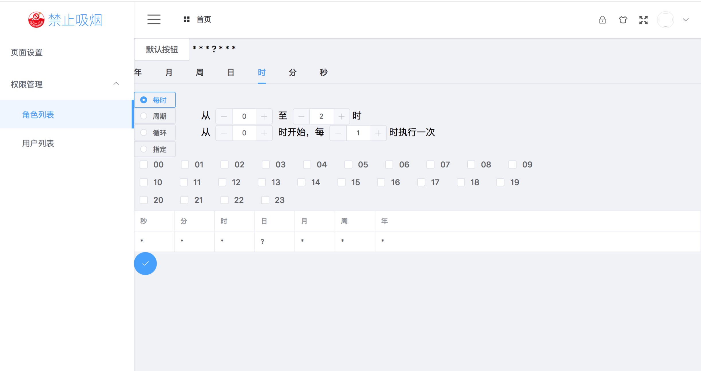
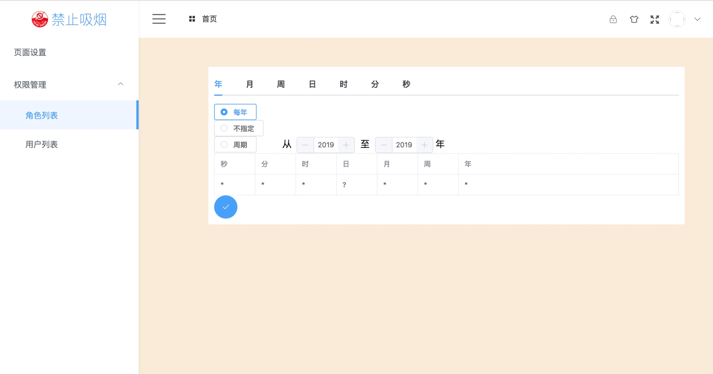

# cron


### 简介
```
参考vue-cron 将vue-cron封装成组件的形式，无需下载源码，使用简单。参考链接：https://www.npmjs.com/package/vue-cron/v/1.0.9
```

### npm引入
```
npm install ecron
```

### main.js中的依赖
```
import ElementUI from 'element-ui'
import 'element-ui/lib/theme-chalk/index.css'

Vue.use(ElementUI)
```

### 使用案例
```
<template>
  <div id="app">
    <ecron @get="get" v-if="show"></ecron>
    <el-button @click="click">默认按钮</el-button>
    {{cron}}
  </div>
</template>

<script>
import ecron from 'ecron'      // 说明1（下有解释）
export default {
  name: 'app',
  components: {
    ecron
  },
  data() {
    return {
      cron: '',
      show: false           // 说明3（下有解释）
    }
  },
  methods: {
    click () {
      this.show = true
    },
    get(val) {              // 说明2 （下有解释）
      this.show = false
      this.cron = val
    }
  }
}
</script>
```
###  案例说明(三个步骤)
```
说明1、首先引入插件 ecron，并注册
说明2、写一个方法接受ecron组件给你的返回值
说明3、定义一个变量，控制组件的隐藏和显示

```

## 解决方案
### 在某些环境 样式会变 如图


### 解决办法 添加两层div 和相应的css来解决
```
// html
<div class="ecron" v-if="show">
    <div class="center">
        <ecron  v-if="show" @get="get"></ecron>    
    </div>
</div>  

// less
.ecron {
    width: 100%;
    z-index: 999;
    position: fixed;
    left: 240px;
    right: 0;
    bottom: 0;
    top: 64px;
    background-color: antiquewhite;
    .center {
        width: 800px;
        // height: 100%;
        // margin: 0 auto;
        margin-left: 120px;
        margin-top: 50px;
        background-color: #ffffff;
        padding: 10px;
    }
}
```
#### 解决完如下图




